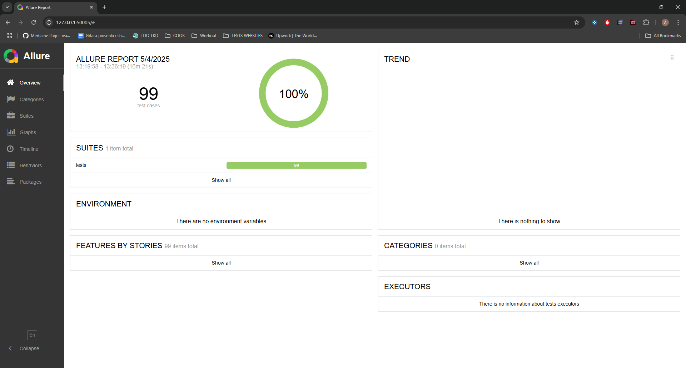

# 🛠️ QA Automation Project – E2E Testing with Selenium & Allure

This is a simulated freelance project created to demonstrate professional-level QA Automation skills.    
It covers full end-to-end testing of the [SauceDemo](https://www.saucedemo.com) e-commerce site using **Selenium + Pytest + Allure**, following industry best practices.


[](https://maragoth.github.io/qa-automation-project/)  


---

## 🎯 Project Goals

- ✅ Automate main user flows: login, add to cart, sort, checkout, logout
- ✅ Cover both positive and negative test scenarios
- ✅ Capture step-by-step screenshots and detailed logs
- ✅ Ensure 100% test stability using custom helper architecture
- ✅ Use Page Object Model for clean and scalable code
- ✅ Generate Allure and HTML test reports
- ✅ Run tests automatically via GitHub Actions CI

---

## 🧰 Tech Stack

| Tool / Library     | Purpose                          |
|--------------------|----------------------------------|
| Python             | Main programming language        |
| Selenium           | Web automation engine            |
| Pytest             | Test runner                      |
| Allure             | Professional test reporting      |
| Pytest-HTML        | Optional fallback report         |
| GitHub Actions     | Continuous Integration (CI)      |
| Page Object Model  | Scalable test design pattern     |

---

## 📁 Folder Structure

<pre>
qa_automation_project
├── .github/workflows/           # GitHub Actions workflow (ci.yml)
├── allure-report/               # Generated Allure HTML report
├── allure-results/              # Allure raw data (ignored in repo)
├── drivers/chromedriver-win64/ # Local ChromeDriver binary
├── helpers/                     # Custom helper functions 
├── images/                      # Images used in documentation 
├── pages/                       # Page Object classes 
├── reports/assets/             # Report-related files 
├── screenshots/                # Screens from successful test steps
├── screenshots_failed/         # Screenshots from failed test steps
├── screenshots_failed_steps/   # Screenshots from failed helper steps
├── tests/                       # Test cases (positive & negative)
├── .gitignore                   # Files excluded from Git
├── LICENSE                      # MIT License
├── README.md                    # Project documentation
├── conftest.py                  # Pytest config + fixtures
├── pytest.ini                   # Pytest configuration file
├── requirements.txt             # Python dependencies
└── qa_automation_project.code-workspace # VSCode workspace config
</pre>


---

## 🚀 How to Run Tests

1. Clone the repository

```bash
git clone https://github.com/Maragoth/qa-automation-project
cd qa-automation-project
```

2. (Optional) Create virtual environment
```bash
python -m venv venv
venv\Scripts\activate  # or source venv/bin/activate on macOS/Linux
```

3. Install dependencies
```bash
pip install -r requirements.txt
```

4. Run all tests and generate Allure results
```bash
pytest tests/ --alluredir=allure-results
```

5. Generate and open Allure Report
```bash
C:\Allure\bin\allure.bat serve allure-results
```
6. View the generated report.

Below is an example of a successful Allure report (100% passed):


## ⚙️ Continuous Integration (CI) – GitHub Actions
This project includes full CI setup with GitHub Actions:

- Automatically runs on each push to main

- Generates HTML or Allure reports

- Uploads the report as artifact (v4)

- Does not stop the workflow on test failure (continue-on-error: true)

Artifacts
After each run, reports are available for download under GitHub Actions → Run → Artifacts tab.


## 📊 Live Allure Report

[](https://maragoth.github.io/qa-automation-project/)


## ✅ Summary

This project demonstrates my ability to:

- Build full-stack automated testing from scratch

- Design test architecture using Page Object Model

- Generate readable and professional test reports

- Ensure full test stability and isolation

- Think like a QA Engineer – not just write tests

## 👤 About Me as QA:

My name is Adam Fedorowicz, a QA Automation Engineer passionate about building real-world testing frameworks using scalable architecture.
I specialize in Selenium, Pytest, API testing (Postman), and CI workflows.
This project is part of my growing QA portfolio, aiming to showcase reliable, clean, and professional test automation.

## 📫 Find Me Online

- 🌐 [LinkedIn – Adam Fedorowicz](https://www.linkedin.com/in/adam-fedorowicz-UK)
- 💻 [GitHub – Maragoth](https://github.com/Maragoth)
- 💼 [Upwork – QA Automation Engineer](https://www.upwork.com/freelancers/~018d6c0e188850f30d?mp_source=share)


© 2025 Adam Fedorowicz  
This project is licensed under the MIT License.